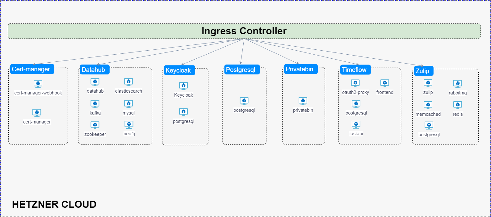

## Prerequisites Setup
* Install kubectl
```
curl -LO "https://dl.k8s.io/release/$(curl -L -s https://dl.k8s.io/release/stable.txt)/bin/linux/amd64/kubectl" && \
  curl -LO "https://dl.k8s.io/$(curl -L -s https://dl.k8s.io/release/stable.txt)/bin/linux/amd64/kubectl.sha256" && echo "$(cat kubectl.sha256)  kubectl" | sha256sum --check && \
  sudo install -o root -g root -m 0755 kubectl /usr/local/bin/kubectl && kubectl version --client --output=yaml
```

* Helm 3.0.0+
```  
curl https://baltocdn.com/helm/signing.asc | gpg --dearmor | sudo tee /usr/share/keyrings/helm.gpg > /dev/null && \
  sudo apt-get install apt-transport-https --yes && \
  echo "deb [arch=$(dpkg --print-architecture) signed-by=/usr/share/keyrings/helm.gpg] https://baltocdn.com/helm/stable/debian/ all main" | sudo tee /etc/apt/sources.list.d/helm-stable-debian.list && \
  sudo apt-get update && sudo apt-get install helm  
```

* Helm upgrade plugin diff
```
helm plugin install https://github.com/databus23/helm-diff
```
* Fresh deployment, must create and select namespace
``` 
kubectl create ns $NAMESPACE  
kubectl config set-context --current --namespace=$NAMESPACE
```
* envsubst
  * macos:
    `brew install gettext`
  * debian/ubuntu:
    `apt-get install gettext-base`

### How to create a simple PostgresSQL deployment
This chart bootstraps a PostgreSQL deployment using the Helm package manager.

* Create and select namespace
``` 
kubectl create ns postgres  
kubectl config set-context --current --namespace=postgres
```
  
* Create a new Helm chart
```
helm create postgres-chart
```

* Create decrypted secrets.yaml file
The following command example creates a file with credentials for postgresql in plain text.

  ```
  cat <<EOF > secrets-dec.yaml
  db:
    user: super_user_example
    password: super_pass_example
  EOF
  ```

* Encrypt secrets.yaml file   
The following command will encrypt the previous secrets-dec.yaml file using <a href="https://github.com/mozilla/sops" target="_blank"> SOPS: Secrets OperationS </a> and AWS Key Managament Service.
``` 
sops -e  --kms '<YOUR_AWS_KMS_KEY>' secrets-dec.yaml > secrets.yaml
```

* Upgrade or install release
Refer to values.yaml for the database values:
```yaml
---
RELEASE_NAME: <YOUR_RELEASE_NAME>
CHART_NAME: <YOUR_CHART_NAME>
---
```
```
helm secrets upgrade --install $RELEASE_NAME $CHART_NAME -f raw.values.yaml -f secrets.yaml
 ```
  
* Access to postgresql
```
kubectl exec -it < POSTGRESQL-POD-NAME > -- bash 
```
  
* Uninstall release
For a complete uninstall, make sure to delete pvc created.

``` 
helm uninstall $RELEASE_NAME
kubectl delete pvc $RELEASE_NAME-pvc
```
## Deployments on Hetzner cloud
This section shows more in detail on how to deploy each app on dyvenia infrastructure.
* <a href="https://github.com/dyvenia/infrastructure/tree/main/deployments/datahub" target="_blank"> Datahub deployment</a>
* <a href="https://github.com/dyvenia/infrastructure/tree/main/deployments/cert-manager" target="_blank"> Cert-manager deployment </a>
* <a href="https://github.com/dyvenia/infrastructure/tree/main/deployments/ingress" target="_blank"> Ingress Controller deployment </a>
* <a href="https://github.com/dyvenia/infrastructure/tree/main/deployments/postgresql" target="_blank"> PostgreSQL deployment </a>
* <a href="https://github.com/dyvenia/infrastructure/tree/main/deployments/privatebin" target="_blank"> PrivateBin deployment </a>
* <a href="https://github.com/dyvenia/infrastructure/tree/main/deployments/timeflow" target="_blank"> Timeflow deployment </a>
* <a href="https://github.com/dyvenia/infrastructure/tree/main/deployments/oauth2" target="_blank"> Proxy-oauth2 deployment </a>
* <a href="https://github.com/dyvenia/infrastructure/tree/main/deployments/keycloak" target="_blank"> Keycloak deployment </a>
* <a href="https://github.com/dyvenia/infrastructure/tree/main/deployments/zulip" target="_blank"> Zulip deployment </a> 